# Jarkom_Modul3_Lapres_C04

#### Anggota :
#### 05111840000029	Khofifah Nurlaela
#### 05111840000053	Yulia Niza

<br>

#### 1.	Membuat topologi jaringan

 ```
nano topologi.sh 
  ```

Mengatur interface pada setiap uml :  ```nano /etc/network/interfaces  ```

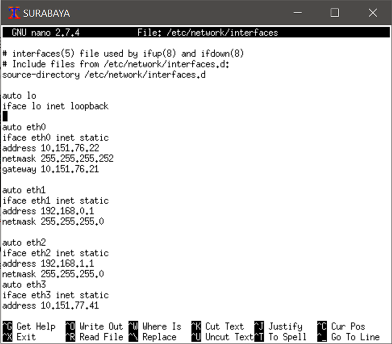
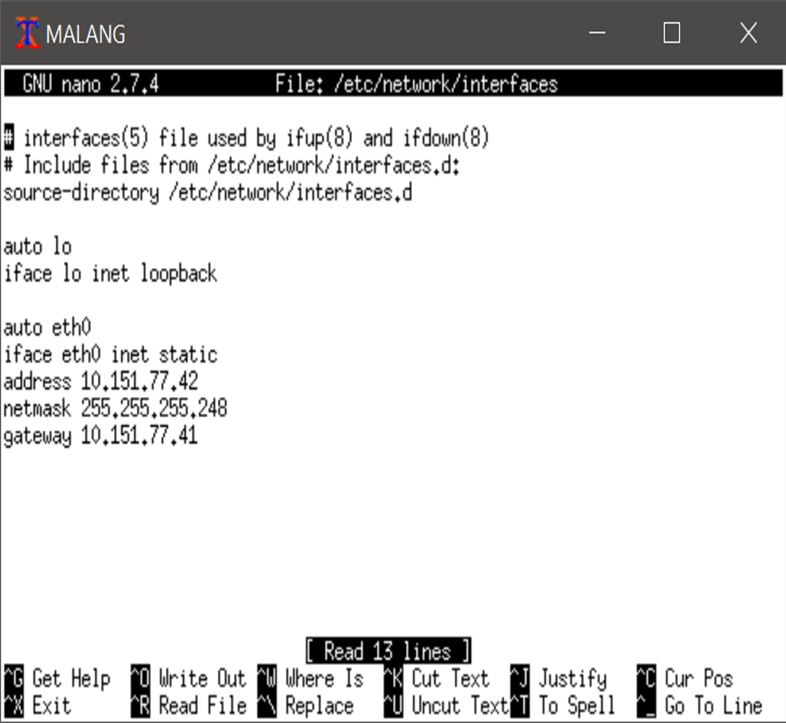
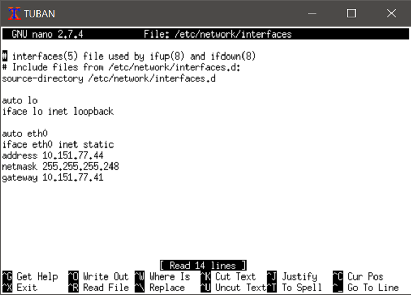
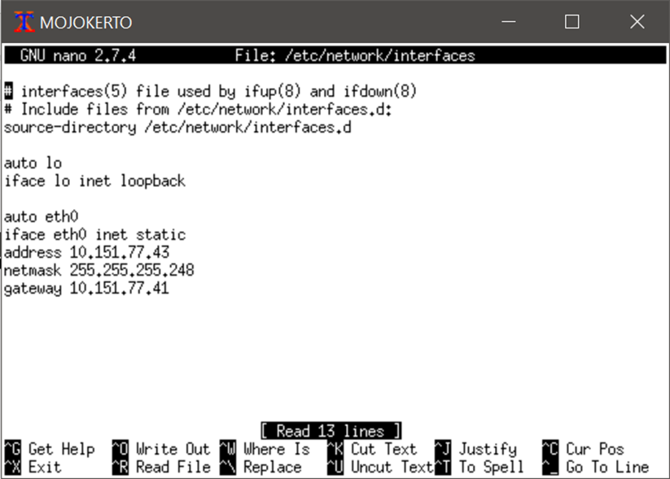

Mengatur interface pada uml client agar tidak menggunakan konfigurasi IP Statis :

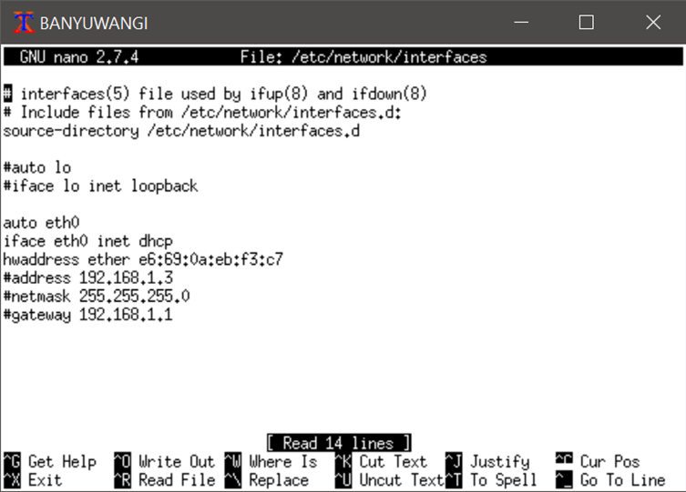
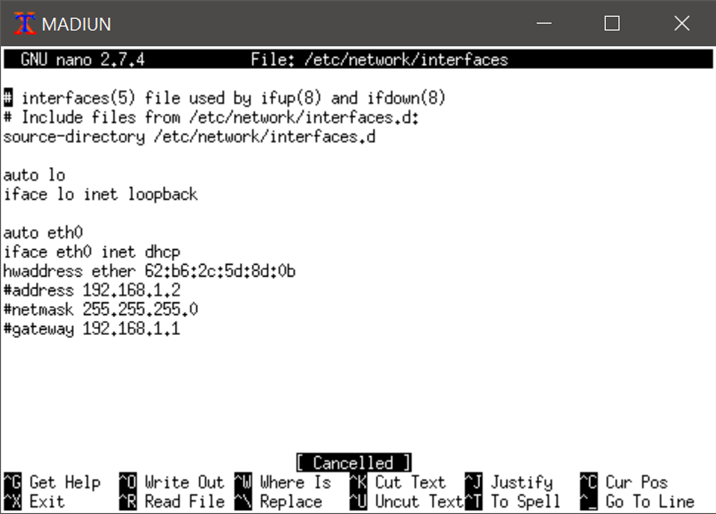
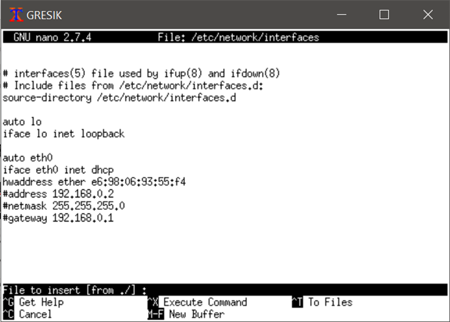


Restart pada setiap uml :  ``` service networking restart ```

#### 2. SURABAYA ditunjuk sebagai perantara (DHCP Relay) antara DHCP Server dan client
-	Install dhcp-relay pada surabaya : ``` apt-get install isc-dhcp-relay ```
-	Konfigurasi interface dhcp-relay pada surabaya : ``` nano /etc/default/isc-dhcp-relay  ```. 
- Atur agar server mengarah ke tuban dengan ``` SERVERS="10.151.77.44" ```dan  ```INTERFACESv4="eth1 eth2 eth3" ```
- Lalu Restart : ``` service isc-dhcp-relay restart ```

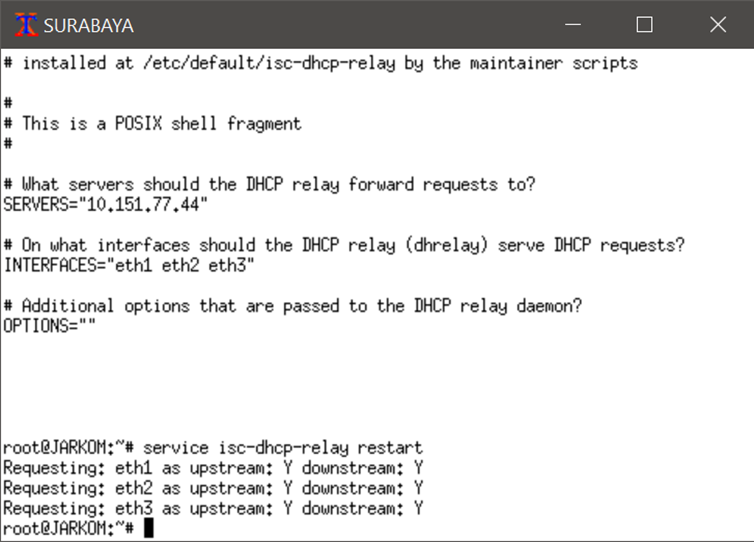

- Konfigurasi interfaces dhcp-server pada Tuban : ``` nano /etc/default/isc-dhcp-server ``` dengan ```INTERFACESv4="eth0" ``` 

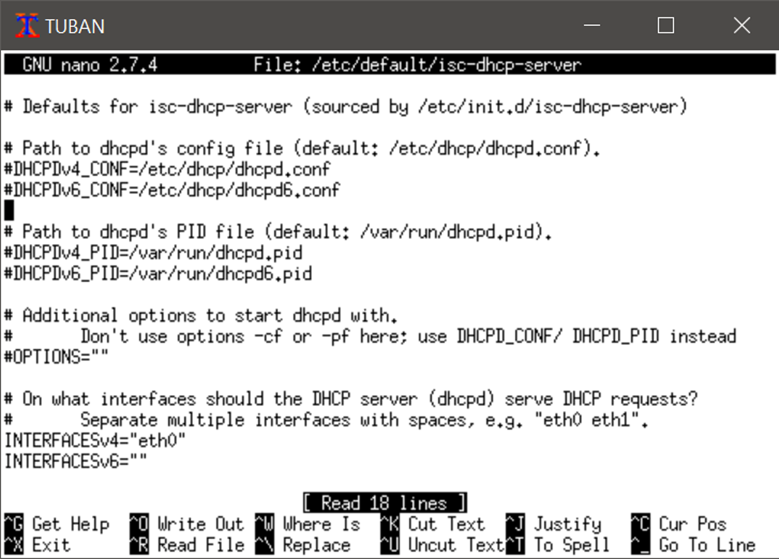

- Konfigurasi pada dhcp-server :  ``` nano /etc/dhcp/dhcpd.conf  ```
-	Restart :  ``` service isc-dhcp-relay restart  ```

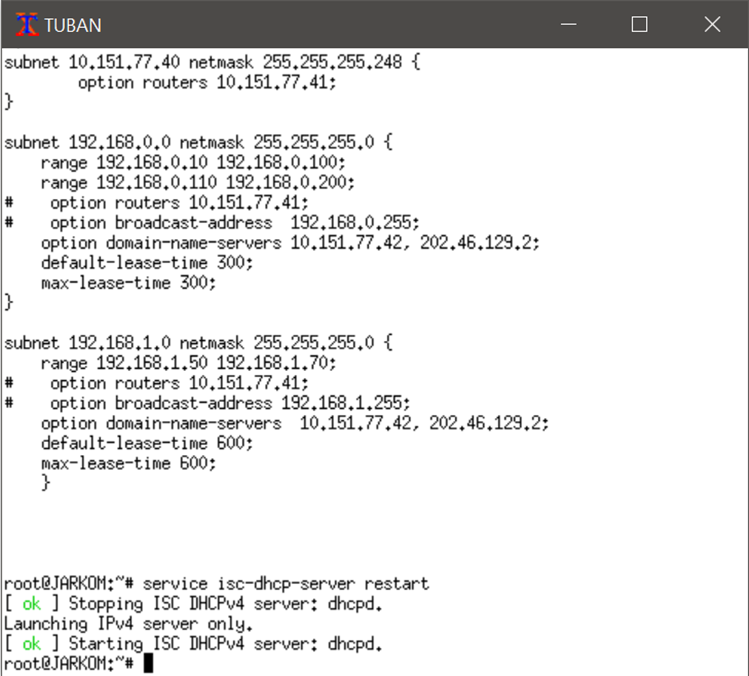


#### 3. Client pada subnet 1 mendapatkan range IP dari 192.168.0.10 sampai 192.168.0.100 dan 192.168.0.110 sampai 192.168.0.200
Lakukan ``` Service networking restart``` pada client lalu ``` ifconfig ``` untuk memeriksa ipnya :

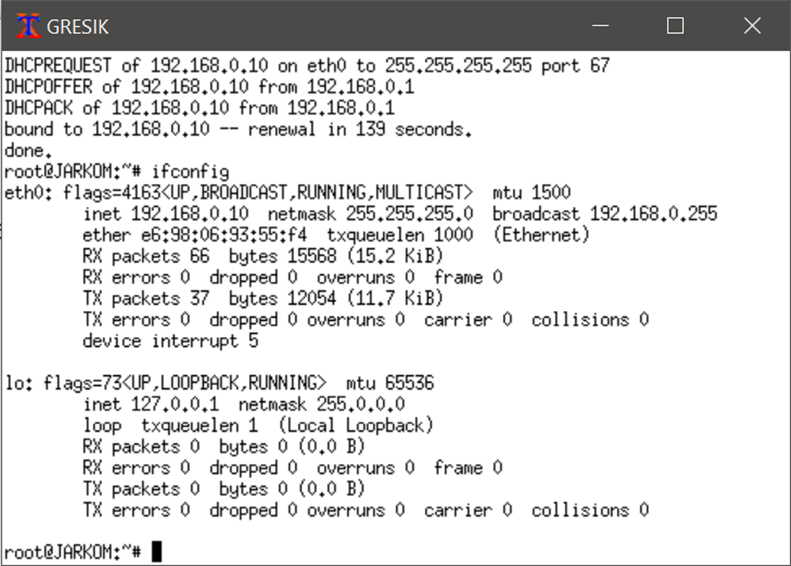
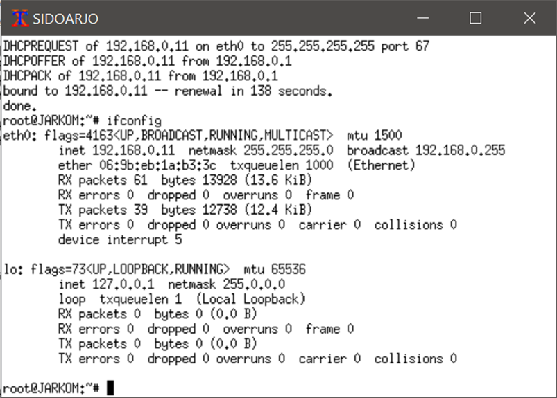

#### 4.	Client pada subnet 3 mendapatkan range IP dari 192.168.1.50 sampai 192.168.1.70.
Lakukan ``` Service networking restart``` pada client lalu ``` ifconfig ``` untuk memeriksa ipnya :

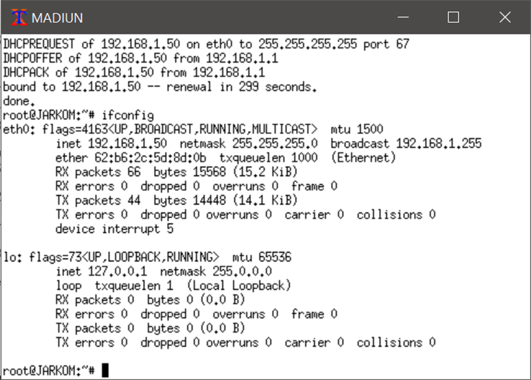


#### 5.	Client mendapatkan DNS Malang dan DNS 202.46.129.2 dari DHCP

Periksa pada setiap client  ``` cat /etc/resolv.conf ```

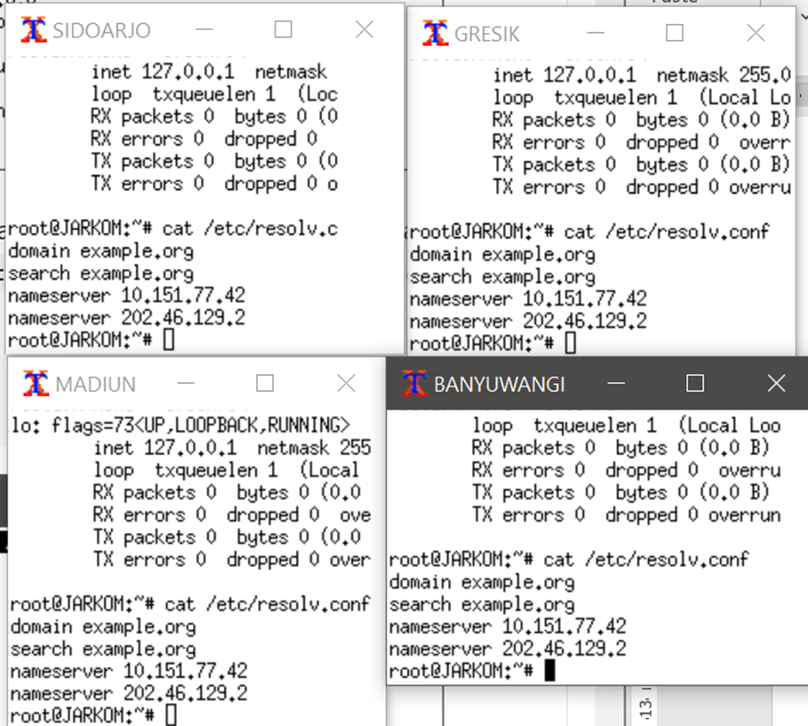

#### 6.	Client di subnet 1 mendapatkan peminjaman alamat IP selama 5 menit, sedangkan client pada subnet 3 mendapatkan peminjaman IP selama 10 menit.

Pada konfigurasi terlihat pada default-lease-time pada subnet 1 adalah 300 detik atau 5 menit dan pada subnet 3 adalah 600 detik atau 10 meniit

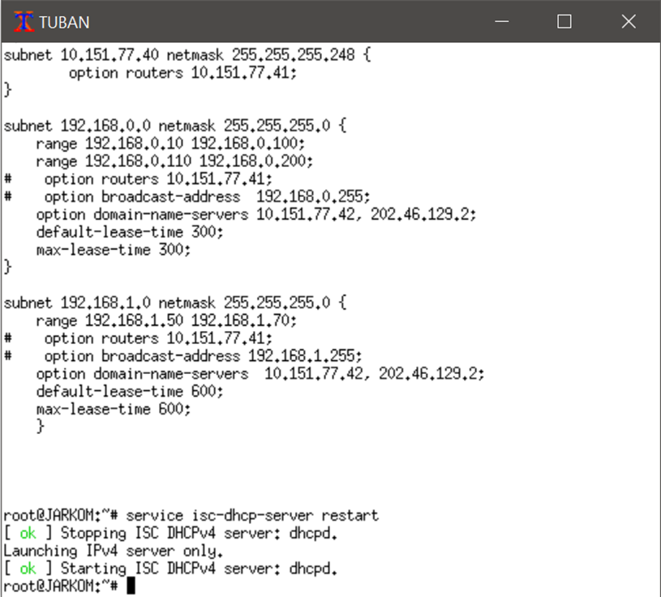

